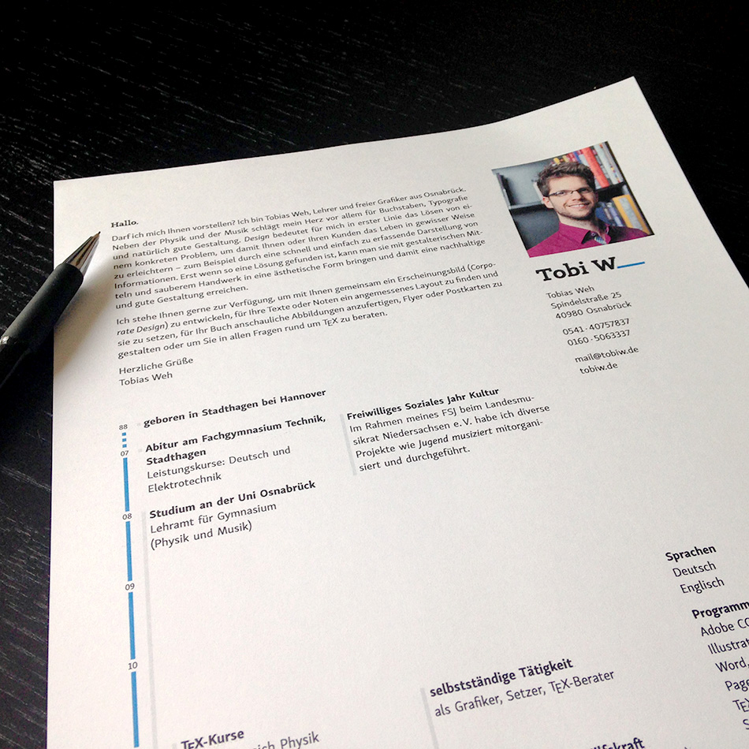

# My Curriculum Vitae and Portfolio  

This is my CV together with a rather small portfolio of my work. It was made with TeX using TikZ and the new LaTeX3 syntax.

This repo contains all the code I used to build it. To compile it on your computer you may have to set the option `load-fonts` of citobiw.sty to `false` if don’t have _Skolar Sans_, _Canape Serif_, and _Source Code Pro_ installed.  
Note that you must compile the document twice to get the right positions.

The packages are documented directly in the *.sty files. If you have any questions send me an e-mail at <mail@tobiw.de> or use the issue tracker.

## Files and Folders

- `citobiw.sty` – this package contains all necessary settings for my own corporate design
- `cv_tobiw.tex` – this is the **main project file** to generate the document
- `cvtobiw.sty` – this is the package I made to build up my CV in nice graphical way with TikZ
- `img/` – in this directory are all necessary images
- `makefile` – a makefile to build a ZIP containing the sources and PDFs
- `README.md` – _this file_

## License

You may use my code as an inspiration for your own CV and if you like drop me a note what you created with it (<mail@tobiw.de>). Furthermore it would be nice to mention my name in your project.

However my logo, color scheme and combination of typfaces is copyrighted and you may **not use** it without my permission.